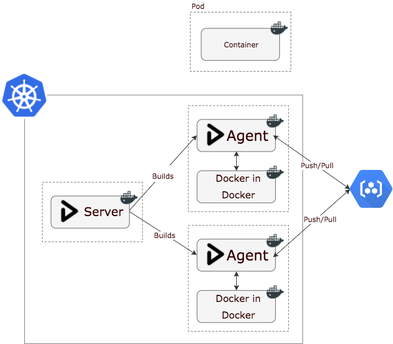
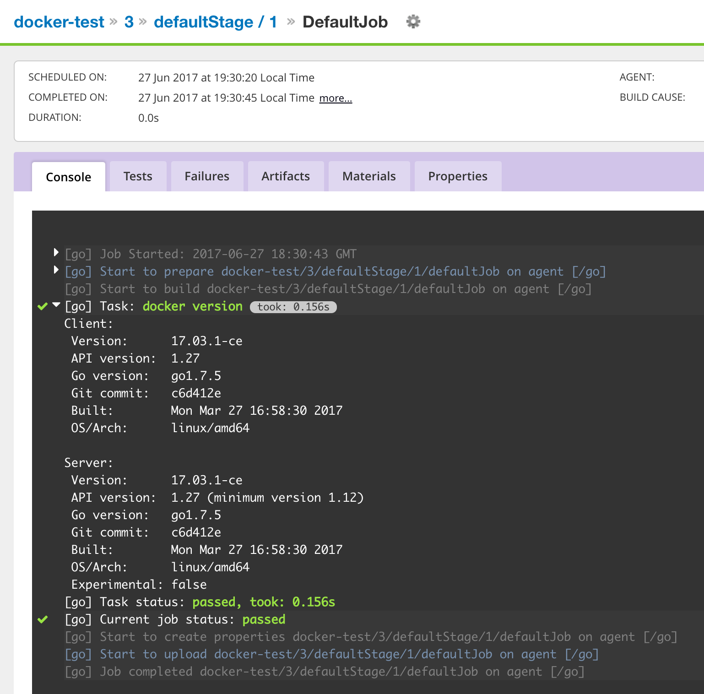

# GoCD on Kubernetes (GKE) with Docker (in docker) 
An evolution of my journey of GoCD on Kubernetes, for building and deploying container based services.

## History
[ci-in-a-box](https://github.com/Stono/ci-in-a-box) was the first iteration of a "click, deploy and off you go" solution to GoCD on kubernetes.  However, through using it for the past year there were some learnings, and some aspects I wanted to change.  Along with the massive change to GoCDs base images with go 17.3.0, I decided to start afresh.

### The Problems
I had been running GoCD agents in docker containers, and then volume mounting the docker socket from the host, so that the agents could build and deploy docker containers.

This had multiple problems:
 
  - Mounting the host docker process is in no way isolated, and privilege escalation is a massive problem
  - Running on kubernetes, you had access to the underlying kubernetes machine and could destroy your cluster quite easily
  - Agents weren't isolated, so a build job on one agent could affect a build job on another
  - Things like volume mounts don't work, they'd be mounting from your agents host machine, rather than from the agents filesystem
  - We are limited to the version of docker on the host, which for Google Container Engine (managed kubernetes) is quite old, so we're missing cool features

#### Docker in Docker 
So I started looking at [docker in docker](https://hub.docker.com/_/docker/) and thought it would be nice if my gocd agents ran their own docker daemon, totally isolated, no reason to have access to the host they're running on.

The idea on kubernetes is that your kubernetes agent pod has two containers, one is the gocd-agent itself, the other is docker-in-docker, they scale linearly, so each agent gets its own unique docker daemon.  The gocd-agent talks to the docker daemon via TCP.

Docker in Docker carries its own problems, theres a good blog post on [here](https://jpetazzo.github.io/2015/09/03/do-not-use-docker-in-docker-for-ci/), however the dind image is now officially supported and most of the issues have been mitigated.  The only downside I can see now is its a little slower (as you're doing filesystems on top of filesystems), but that's a fair trade in exchange for a more secure setup.

It's probably easier to digest as a diagram.  Each agent builds against it's own isolated docker, and then pushes the build artifact up to the container registry.

#### Shared volumes
If you've ever run a CI agent inside a docker container, and your build job has needed to volume mount data from the agents working directory - you'll have found that it doesn't work.  This is because you're actually acting on the daemon on the host system, so you're volume mount a directory from the parent, rather than the agent.

This setup addresses that by mutually mounting `/godata` between the go agent, and docker in docker containers.

## Running/Deploying
The idea here is to get you up and running as quickly as possible with GoCD.  

Simply edit the `go.env` file to meet your requirements and then start it up using compose, or deploy to kubernetes.

Both options will run/deploy:

  - GoCD Server (17.6.0)
  - GoCD Agent (with docker-in-docker) 

### Authentication
You've probably noticed `GO_USERNAME` and `GO_PASSWORD` in `go.env`.  These values will be written to `/etc/go-users` on the GoCD server using `htpasswd`.  You will need to enable the authentication the first time you open GoCD by going to `/go/admin/security/auth_configs`.

### Customising your agent
In both situations, we build custom agent and master images - inheriting from the official GoCD images.  If you want to make changes to your agent, simple edit `agent/Dockerfile`

### docker-compose
To run using docker-compose, do:

  - docker-compose build
  - docker-compose up -d

Wait for GoCD to boot and then go to `http://127.0.0.1:8153`

### Kubernetes (on Google Container Engine)
I am presuming you have already deployed a kubernetes cluster on Google Container Engine.  If you haven't, head on over to the `terraform/dev` folder, and do `terraform apply`, that'll build you a shiny new cluster.  Make sure you then update your kubectl command line with the credentials for you new cluster with `gcloud container clusters get-credentials [cluster name]-dev`

To deploy to that cluster, do:
 
  - Make sure your gcloud cli locally is logged in, and targetting your gcloud project
  - Make sure you kubectl is configured to point at the cluster you wish to target
  - ./kubernetes-deploy.sh

Wait for GoCD to boot, and then access it on the service ip.  You can find the IP with `$(kubectl get services | grep master | awk '{print $2}')`.

You can remove GoCD from kubernetes by running `./kubernetes-remove.sh`

#### Persistence
Kubernetes makes use of StatefulSets to persist your agent, and server configuration.

**WARNING**: The PersistentVolumeClaims only live as long as your kubernetes cluster.  Should you blow away your kubernetes cluster you **will** destroy your gocd config and history too.  Make sure you have a backup strategy in place.

## The result
No more `-v /var/run/docker.sock:/var/run/docker.sock` on your agents! 

